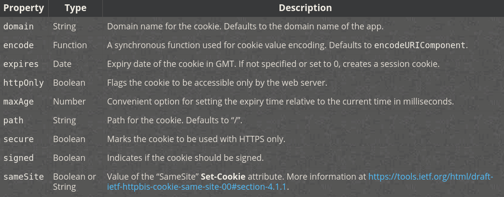
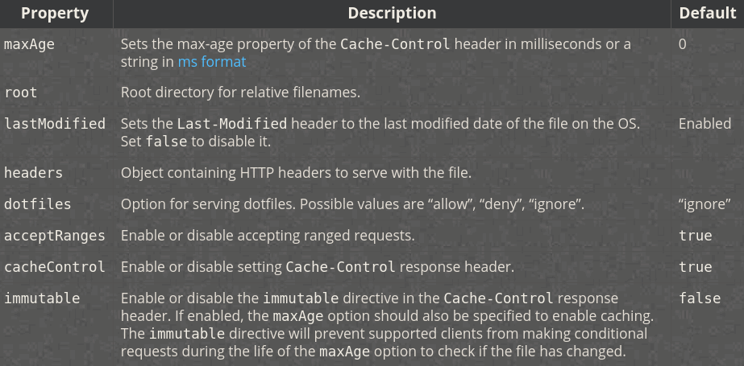

# Express

- [Express](#express)
	- [Sources](#sources)
	- [Intro](#intro)
	- [Middleware](#middleware)
	- [App](#app)
		- [`app.locals`](#applocals)
		- [`app.param()`](#appparam)
		- [`app.render()`](#apprender)
		- [`app.set()` and `app.get()`](#appset-and-appget)
	- [Request](#request)
		- [`req.app` and `res.app`](#reqapp-and-resapp)
		- [`req.originalUrl`, `req.baseUrl`, `req.path`, `req.subdomains`](#reqoriginalurl-reqbaseurl-reqpath-reqsubdomains)
		- [`req.body`](#reqbody)
		- [`req.cookie` and `req.signedCookies`](#reqcookie-and-reqsignedcookies)
		- [`req.hostname`](#reqhostname)
		- [`req.ip` and `req.ips`](#reqip-and-reqips)
		- [`req.method`](#reqmethod)
		- [`req.protocol`](#reqprotocol)
		- [`req.query`](#reqquery)
		- [`req.secure`](#reqsecure)
		- [`req.accepts(types)`](#reqacceptstypes)
		- [`req.get(field)`](#reqgetfield)
	- [Response](#response)
		- [`res.headersSent`](#resheaderssent)
		- [`res.append(field, value)`, `res.set()`, `res.header()`](#resappendfield-value-resset-resheader)
		- [`res.cookie(name, value, options)`, `res.clearCookie(name, options)`](#rescookiename-value-options-resclearcookiename-options)
		- [`res.download(path, filename, options, callback)` and `res.sendFile(same)`](#resdownloadpath-filename-options-callback-and-ressendfilesame)
		- [`res.get(field)`](#resgetfield)
		- [`res.status()` and `res.sendStatus()`](#resstatus-and-ressendstatus)
		- [`res.redirect([status], path)`](#resredirectstatus-path)
		- [`req.writeHead(statusCode, statusMessage, Headers)`](#reqwriteheadstatuscode-statusmessage-headers)

---

## Sources

1. https://www.npmjs.com/package/express
2. https://expressjs.com

***

## Intro

**Express** is a popular framework for **node** which simplifies many things.

**Installation**:

```bash
npm i express
```

You can also install `express-generator` that will create template projects for you:

```bash
npm i -g express-generator@4
express /tmp/foo && cd /tmp/foo
```

***

Basic usage:


```javascript
const express = require('express')
const app = express()

app.get('url', (req, res) => {
	//...
	res.send(data)
	// or `res.json(data)`
})

app.listen(process.env.PORT || 5000)
```

---

## Middleware

See the corresponding [lesson](06.middleware.md).

---


## App

### `app.locals`

Application-wide variables (kinda the global ones between modules). Set them as properties of `app.locals` and access later as properties of `req.app.locals`.

```javascript
// app.js
app.locals = {
	name: 'max',
	age: 20
}
app.locals.sex = 'male'

// router.js
app.get('/', (req, res, next) => {
	console.log(req.app.locals.name) // max
	next()
})
```

---

### `app.param()`

Sets a handler that fires if certain parameter's name (key) appeared. Callback takes up to 5 arguments: 3 standard + `value` + `key` of the parameter.

The handler only fires once during the first parameter appearance (before the actual middleware using it), even if later it will appear multiple times.

```javascript
app.get('/user/:id', function (req, res, next) {
	console.log('this matches')
	next()
})

// called 1 time despite `id` appearing twice in the middleware
app.param('id', function (req, res, next, value, key) {
	// <--- param
	console.log(`${key}: ${value}`)
	next()
})
// This literally means: "if anywhere in the middleware a param with the name `id` appears, call this function once and proceed with the middleware".

app.get('/user/:id', function (req, res) {
	console.log('and this matches too')
	res.end()
})

// Request to `/user/42`

// id: 42
// this matches
// and this matches too
```

We can also provide an array of desired parameters names. In this case the callback will be called for every match.

```javascript
app.get('/user/:id/:page', function (req, res, next) {
	console.log('this matches')
	next()
})

app.get('/user/:id/:page', function (req, res) {
	console.log('and this matches too')
	res.end()
})

app.param(['id', 'page'], function (req, res, next, value) {
	console.log('CALLED ONLY ONCE with ', value)
	next()
})

// Request: /user/42/199

// CALLED ONLY ONCE with 42
// CALLED ONLY ONCE with 199
// this matches
// and this matches too
```

---

### `app.render()`

Used with `pug` or other view engines.

---

### `app.set()` and `app.get()`

`app.set(key, value)` assigns a setting to your app. `app.get(key)` retreives a setting.

```javascript
app.set('title', 'My Site')
app.get('title') // 'My Site'
```

---

## Request

### `req.app` and `res.app`

Both are the same and hold a reference to the instance of the Express application that is using the middleware.

### `req.originalUrl`, `req.baseUrl`, `req.path`, `req.subdomains`

```javascript
app.use('/admin', function (req, res, next) {
	// GET 'max.bar.example.com/admin/new'
	console.dir(req.originalUrl) // '/admin/new'
	console.dir(req.baseUrl) // '/admin'
	console.dir(req.path) // '/new'
	console.dir(req.subdomains) // ['bar', 'max']
	next()
})
```

---

### `req.body`

Contains key-value pairs of data submitted in the request body.By default, it is undefined, and is populated when you use body-parsing middleware such as `express.json()` or `express.urlencoded()`.

```javascript
app.use(express.json()) // for parsing application/json
app.use(express.urlencoded({ extended: true })) // for parsing application/x-www-form-urlencoded

app.post('/profile', function (req, res, next) {
	console.log(req.body)
	res.json(req.body)
})
```

---

### `req.cookie` and `req.signedCookies`

When using cookie-parser middleware, this property is an object that contains cookies sent by the request. If the request contains no cookies, it defaults to `{}`.

### `req.hostname`

```javascript
// Host: "example.com:3000"
console.dir(req.hostname) // => 'example.com'
```

### `req.ip` and `req.ips`

IP.

### `req.method`

GET, POST, etc.

### `req.protocol`

http / https.

### `req.query`

An object containing all the query string parameters.

```javascript
app.use('/', function (req, res, next) {
	console.log(req.query)
	res.end()
})
```

Request `/search?q=cats&key=value` returns: `{ q: 'cats', key: 'value' }`

If **keys** are the same, their values will be gathered into an array: request to `?name=max&name=bar` will produce:


More complex structures are available as well: `?user[id]=7&user[name]=bar`


---

### `req.secure`

Returns `true` if `req.protocol === 'https'`

---

### `req.accepts(types)`

Checks the available types and returns the best match.

```javascript
req.accepts('text/html') // text/html
```

### `req.get(field)`

Returns the specified HTTP request header field (case-insensitive match).

```javascript
req.get('content-type') // => "text/plain"
```

---

## Response

### `res.headersSent`

```javascript
app.get('/', function (req, res) {
	console.dir(res.headersSent) // false
	res.send('OK')
	console.dir(res.headersSent) // true
})
```

### `res.append(field, value)`, `res.set()`, `res.header()`

Appends (sets) `value` to the HTTP header `field`. Set = header

```javascript
res.append('Link', ['<http://localhost/>', '<http://localhost:3000/>'])
res.append('Set-Cookie', 'foo=bar; Path=/; HttpOnly')
res.append('Warning', '199 Miscellaneous warning')

res.set('Content-Type', 'text/plain')

res.set({
	'Content-Type': 'text/plain',
	'Content-Length': '123',
	ETag: '12345'
})
```

### `res.cookie(name, value, options)`, `res.clearCookie(name, options)`

Sets the HTTP `Set-Cookie` header to the options provided. The value parameter may be a string or object converted to JSON.

```javascript
res.cookie('name', 'tobi', {
	domain: '.example.com',
	path: '/admin',
	secure: true
})
res.cookie('rememberme', '1', {
	expires: new Date(Date.now() + 900000),
	httpOnly: true
})
```



We can chain the `cookie` calls to one another.

```javascript
res
	.status(201)
	.cookie('access_token', 'Bearer ' + token, {
		expires: new Date(Date.now() + 8 * 3600000) // cookie will be removed after 8 hours
	})
	.cookie('test', 'test')
	.redirect(301, '/admin')
```

Clearing cookies require the same options as were used during the cookie setting.

```javascript
res.cookie('name', 'tobi', { path: '/admin' })
res.clearCookie('name', { path: '/admin' })
```

### `res.download(path, filename, options, callback)` and `res.sendFile(same)`

Send a file to the client. The path should be absolute unless the `path` option is set. When an error occurs or transfer is complete, the method calls the optional callback function fn. `res.download()` actually translates the call to the underlying `res.sendFile()` with the same parameters.

```javascript
res.download('/report-12345.pdf', 'report.pdf', function (err) {
	if (err) {
		// Handle error, but keep in mind the response may be partially-sent
		// so check res.headersSent
	} else {
		// decrement a download credit, etc.
	}
})
```



Example 1:

```javascript
app.get('/file/:name', function (req, res, next) {
	var options = {
		root: path.join(__dirname, 'public'),
		dotfiles: 'deny',
		headers: {
			'x-timestamp': Date.now(),
			'x-sent': true
		}
	}

	var fileName = req.params.name
	res.sendFile(fileName, options, function (err) {
		if (err) {
			next(err)
		} else {
			console.log('Sent:', fileName)
		}
	})
})
```

Example 2:

```javascript
app.get('/user/:uid/photos/:file', function (req, res) {
	var uid = req.params.uid
	var file = req.params.file

	req.user.mayViewFilesFrom(uid, function (yes) {
		if (yes) {
			res.sendFile('/uploads/' + uid + '/' + file)
		} else {
			res.status(403).send("Sorry! You can't see that.")
		}
	})
})
```

### `res.get(field)`

Returns HTTP-response header.

```javascript
res.get('Content-Type') // => "text/plain"
```

### `res.status()` and `res.sendStatus()`

```javascript
res.sendStatus(200) // equivalent to res.status(200).send('OK')
res.sendStatus(403) // equivalent to res.status(403).send('Forbidden')

res.status(404).sendFile('/absolute/path/to/404.png')
```

### `res.redirect([status], path)`

Redirects to another URL. If `status` is omitted, defaults to `302: Found`.

```javascript
res.redirect(301, 'http://placekitten.com')
res.redirect('../login')
```

Redirects can be relative to the root of the host name or the current URL.

```javascript
// if the application is on `http://example.com/admin/post/new`
res.redirect('/admin')
// will redirect to `http://example.com/admin`

// if the application is on `http://example.com/blog/admin/`
res.redirect('post/new')
// will redirect to `http://example.com/blog/admin/post/new`
```

### `req.writeHead(statusCode, statusMessage, Headers)`

Sends headers to the client. Status code is 3-digit code (404). This method can only be called once before finishing the request-response cycle. Returns a reference to `res`, so the calls can be chained. If any headers have been set with `res.setHeader()`, they will be merged with the `writeHead` headrs, giving the precedence to the latter.

The headers sent with `writeHead()` are sent immediately, `getHeaders()` won't catch them. If you want to save the headers for the future needs, use `setHeader()` instead.

```javascript
res.setHeader('Content-Type', 'text/html')
res.setHeader('X-Foo', 'bar')
res.writeHead(200, { 'Content-Type': 'text/plain' }).end('ok')
```
