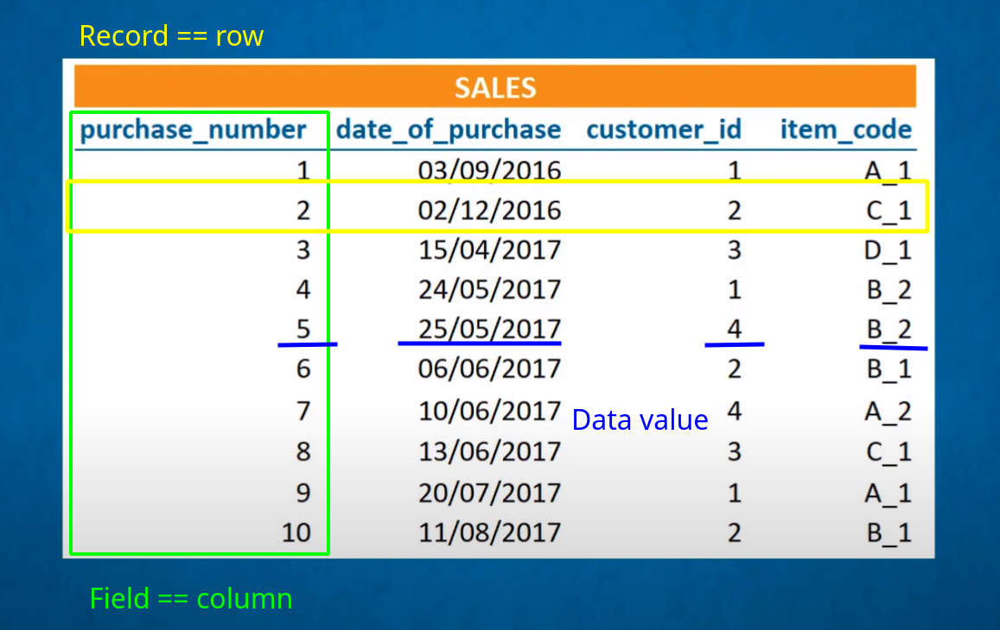
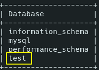

# MySQL

- [MySQL](#mysql)
	- [Sources](#sources)
	- [Theory](#theory)
		- [Connections](#connections)
		- [Terms](#terms)
		- [Types](#types)
		- [Indices](#indices)
	- [Installation and Running](#installation-and-running)
	- [Practice](#practice)
		- [Databases](#databases)
		- [Tables](#tables)
	- [Data manipulation](#data-manipulation)
		- [`SELECT`](#select)
		- [`WHERE`](#where)
		- [`LIMIT`](#limit)
		- [`ORDER BY`](#order-by)
		- [`ALTER`](#alter)
		- [`INSERT`](#insert)
		- [`UPDATE`](#update)
		- [`DELETE`, `TRUNCATE`](#delete-truncate)
		- [`AUTO_INCREMENT`](#auto_increment)

***

## Sources

1. https://medium.com/@rshrc/mysql-on-manjaro-973e4bfc4f05
2. gitgod:
   1. http://gitlab.a-level.com.ua/gitgod/PHP/src/master/ER-SQL.md
   2. http://gitlab.a-level.com.ua/gitgod/PHP/src/master/SQL.md
   3. http://gitlab.a-level.com.ua/gitgod/PHP/src/master/SQLHomeWork.md
3. https://www.w3schools.com/sql/
4. https://dev.mysql.com/doc/refman/8.0/en/
5. https://www.sqltutorial.org
6. https://mariadb.com/kb/en/auto_increment/
7. https://www.techonthenet.com/mysql/tables/alter_table.php#:~:text=The%20syntax%20to%20drop%20a,of%20the%20table%20to%20modify.


***


## Theory 

MySQL is a **relational** (because data is stored in tables that are related to each other) database system. 

***


### Connections

- One to One (rare)
- One to Many (often): one post and many comments to it
- Many to Many: many posta and many tags

To handle "Many to Many" connection, we need an extra table.

***


### Terms

- **data value** - single value
- **record** - a **row** of data values
- **field** - a **column** of data values
- **entity** - a set of meaningful data (row, column, table, etc.)



***


### Types

Since databases are intent to store huge amounts of data, there are many types of data that you can use to store just the amount of data you need (and no more!).

Numeric:

| Type                                     | Description                                                                                                                                                        | Bytes  |
| ---------------------------------------- | ------------------------------------------------------------------------------------------------------------------------------------------------------------------ | ------ |
| `TINYINT`                                | `-128` to `127`                                                                                                                                                    | 1      |
| `SMALLINT`                               | `-32768` to `32767`                                                                                                                                                | 2      |
| `MEDIUMINT`                              | `-8388608` to `8388607`                                                                                                                                            | 3      |
| `INT`                                    | `-2147483648` to `2147483647`                                                                                                                                      | 4      |
| `BIDINT`                                 | `-9223372036854775808` to `9223372036854775807`                                                                                                                    | 8      |
| `FLOAT(p)`                               | Floating point number. Effective for mathematical calculations. If precision `p` is 0-24 - the data type is 4-byte `FLOAT`, if `p` is 25-53 - 8-byte `DOUBLE`      | 4, 8   |
| `DECIMAL(digits, decimals)` == `NUMERIC` | Fixed point number, effective for calculations where the maximum precision is needed (e.g. with money). `DECIMAL(5,2)` can store values from `-999.99` to `999.99` | Varies |

Any of the described types can be **unsigned** if you add the word: `TINYINT UNSIGNED`: 

***

String:

| Type                     | Description                                                                                                                                                                                                                             | Bytes               |
| ------------------------ | --------------------------------------------------------------------------------------------------------------------------------------------------------------------------------------------------------------------------------------- | ------------------- |
| `CHAR(size: 0-255)`      | Fixed-length string, size is the max characters stored. `CHAR(30)` stores up to 30 characters. Trailing spaces **are** removed (you write `'ab '` and retreive `'ab'`).                                                                 | size (<= 256 bytes) |
| `VARCHAR(size: 0-65535)` | Variable-length string. Can store 1- and 2-byte characters (specified by the **prefix** which takes 1 or 2 bytes). `65535` is the max length of **sum** of the all VARCHAR values in the `record`. Trailing spaces are **not** removed. | Varies              |

This is how it works in **non-strict** mode:


In **strict** mode, there will be an **error** because of the exceeding length. 

`VARCHAR` is more effective **memory-wise** but `CHAR` is more effective **speed-wise**. 

***

Text: 

| Type         | Bytes            |
| ------------ | ---------------- |
| `TINYTEXT`   | up to255         |
| `TEXT`       | up to 65535      |
| `MEDIUMTEXT` | up to 16777216   |
| `LONGTEXT`   | up to 4294967296 |

Text types are needed for storing **big** amounts of data. Also, **full-text search** is possible for these types. 

***

Date and time:

| Type          | Description                                                                            |
| ------------- | -------------------------------------------------------------------------------------- |
| `DATE`        | YYYY-MM-DD                                                                             |
| `TIME`        | HH:MM:SS                                                                               |
| `DATETIME`    | YYYY-MM-DD HH:MM:SS                                                                    |
| `TIMESTAMP`   | DATETIME that gets **automatically** filled and **updated** when the record if changed |
| `YEAR(2 | 4)` | Year in 2- or 4-digit format (use 4)                                                   |

***

Other types:

| Type   | Description |
| ------ | ----------- |
| `JSON` |

***


### Indices

Databases store huge amounts of data, so sorting it would be madness. Instead, it has lists of **indices** or **links** related to **records**. And these indices can be sorted easily. 

**Unsorted** search in 1000 records would take up to 1000 comparisons (computational complexity `O(n)`). 

**Sorted** arrays of data can be searched with a **binary search** (`O(log2(n))`). We'll need 10 comparisons to find data among 1000 records, 11 - for 2000, etc.

Indices can be created at any moment, not just at the table creation. 

***


## Installation and Running

Open the Terminal and run these commands. For Manjaro:

1. `sudo pacman -S mysql` or `sudo pacman -S mariadb`
2. Pick the 1st option if you are promped to choose.
3. `sudo systemctl start mysqld`
4. If you got an error, type this: `sudo mysql_install_db --user=mysql --basedir=/usr --datadir=/var/lib/mysql`
5. `sudo systemctl start mysqld && sudo mysql_secure_installation`
6. You will be prompted to answer a few questions about whether to delete the default database or leave it be, and some others similar. 
7. Run `mysql -u root -p`. Enter the password you've chosen during the installation. 

To run it the other day you should:

1. enable the SQL server: `sudo systemctl start mysqld`
2. enter the database: `mysql -u root -p`

***


## Practice

### Databases

In the MySQL CLI every expression should end with a semicolon `;`

**Keywords** are case-insensitive. In many tutorials they are written in Upper-case.

Create new database and use it:

```sql
/* create new database */
CREATE DATABASE IF NOT EXISTS test;

/* show all databases */
show databases;

/* select a database to not write its name over and over */
use test;
```



***


### Tables

Information is stored in tables. **Create new table**:

```sql
CREATE TABLE IF NOT EXISTS person (
	person_id INT UNSIGNED AUTO_INCREMENT PRIMARY KEY,
	name      VARCHAR(64),
	surname   VARCHAR(64),
	father_name VARCHAR(64)
);
```

***

**Show tables**:

```sql
SHOW TABLES;
```


***

Show the table **structure**:

```sql
DESC person;
```


***

Show instruction **how to create** such a table:

```sql
SHOW CREATE TABLE person;
```

The result might be different from what we actually used because this is a generated query based on the *actual current* table structure. 

Useful when you want to create a copy of your table on another server (production). 

***


**Add index**:

```sql
ALTER TABLE person ADD INDEX (date_of_birth);
```

***


## Data manipulation

### `SELECT`

Powerful tool for getting data from tables:

```sql
/* not the full list of options */
SELECT
    <field1>
    <field2>
    <field3>
    ...
FROM
    <table1>
    <table2>
    <table3>
    ...
WHERE
    <cond>
ORDER BY
    <field1> ASC
    <field2> DESC
LIMIT
    N,M
```

Show all records:

```sql
SELECT * FROM person;
SELECT id, name FROM person;
```

***

### `WHERE`

Used to filter records (similar to `if`). See examples below.

***

### `LIMIT`

Limits the amount of changed records. You can use it if you unsure of your changes.

```sql
UPDATE person SET date_of_birth = '1000-00-00' WHERE person_id > 0 LIMIT 1;
```

Only one record was changed:


***

### `ORDER BY`

Sort data. Can be `ASC` and `DESC`. 

Can be performed by several fields, in this case it sorts by the first field, then by the second (without breaking the first one), etc.

```sql
SELECT column1, column2, ...
FROM table_name
ORDER BY column1, column2, ... ASC|DESC;
```

***

### `ALTER`

Changes table or columns.

```sql
/* Add columns */

ALTER TABLE contacts
	/* add after the column `contact_id` */
	ADD last_name varchar(40) NOT NULL AFTER contact_id,	
	/* make the 1st column */
	ADD first_name varchar(35) NULL FIRST;	


/* Delete columns */

ALTER TABLE animals 
	DROP COLUMN last_name, 
	DROP COLUMN first_name;


/* Modify columns */

ALTER TABLE contacts
  	MODIFY last_name varchar(55) NULL AFTER contact_type,
  	MODIFY first_name varchar(30) NOT NULL;


/* Change the AUTO_INCREMENT default value */

ALTER TABLE test 
	AUTO_INCREMENT = 100;


/* Rename columns */

ALTER TABLE table_name
  CHANGE COLUMN old_name new_name 
    column_definition
    [ FIRST | AFTER column_name ]


/* Rename a table */

ALTER TABLE table_name 
	RENAME TO new_table_name;
```

***

### `INSERT`

```sql
/* Insert one or multiple values */

INSERT INTO person 
	(firstname, surname) 
	VALUES 
		('max', 'bar'),
		('vlad', 'kravich'),
		('alina', 'nosova')

	
/* Clearer way of inserting one value */

INSERT INTO person 
	SET 
		date_of_birth = '1999-05-25', 
		firstname = 'Vasil', 
		surname = 'Pupkin', 
		father_name = 'Borisovich';
```

Don't touch the **autoincrement** field - it will grow by itself. The rest of the missed fields (`data_of_birth` and `surname` here) will be filled with default values (that can be set upon the table creation).

***

### `UPDATE`

Update records. Don't use without `WHERE` or `LIMIT` or you can lost your data!

```sql
/* Update all records !!! */

UPDATE person 
	SET date_of_birth = '2000-00-00';


/* Update records that meet the condition */

UPDATE person 
	SET date_of_birth = '1999-05-25' 
	WHERE person_id = 2;


/* Update a column */

UPDATE person 
	SET fullname = CONCAT(name, ' ', father_name, ' ', surname);
```


***

### `DELETE`, `TRUNCATE`

Don't use without `WHERE` or `LIMIT` or you can will your data!

```sql
/* Delete the matching data */
DELETE FROM person WHERE person_id < 2;

/* Deleta data but leave the table */
TRUNCATE TABLE Persons;
```

***

### `AUTO_INCREMENT`

Allows a unique number to be generated automatically when a new record is inserted into the table. Often this is the primary key field that we would like to be created automatically every time a new record is inserted.

MySQL and MariaDB use the `AUTO_INCREMENT` keyword to perform an auto-increment feature.

It must be some kind of a **key** (`PRIMARY KEY`, `UNIQUE`, etc.)

Each table can only have one `AUTO_INCREMENT` column. 

```sql
CREATE TABLE animals (
     id MEDIUMINT NOT NULL AUTO_INCREMENT,
     name CHAR(30) NOT NULL,
     PRIMARY KEY (id)
 );

INSERT INTO animals (name) VALUES
    ('dog'),('cat'),('penguin'),
    ('fox'),('whale'),('ostrich');

SELECT * FROM animals;
```


The **default** value is 1 and will increment by 1 for each new record. You can set a **different** default value:

```sql
ALTER TABLE Persons AUTO_INCREMENT=100;
```

You **don't need** to set the value of the *auto increment* field when isert a new record into the table, it will be added automatically.

