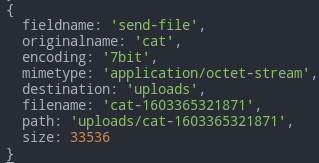
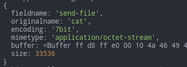
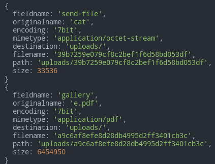

# Multer

- [Multer](#multer)
	- [Sources](#sources)
	- [Warning](#warning)
	- [Intro](#intro)
	- [**`multer`**`([opts])`](#multeropts)
		- [`storage`](#storage)
			- [File Info](#file-info)
			- [`DiskStorage`](#diskstorage)
			- [`MemoryStorage`](#memorystorage)
		- [`limit`](#limit)
		- [`fileFilter`](#filefilter)
	- [Methods](#methods)
		- [`upload`**`.single`**` (filename)`](#uploadsingle-filename)
		- [**`.array`**` (fieldname[, maxCount])`](#array-fieldname-maxcount)
		- [**`.fields`**` (fields)`](#fields-fields)
		- [**`.none`**` ()`](#none-)
		- [**`.any`**` ()`](#any-)
	- [Error handling](#error-handling)

***

## Sources

1. https://www.npmjs.com/package/multer

***

## Warning

Make sure that you always handle the files that a user uploads. Never add `multer` as a global middleware since a malicious user could upload files to a route that you didn't anticipate. 

## Intro

Install

```bash
npm i multer
```

Basic usage

```js
const multer = require('multer')
const upload = multer({ dest: 'uploads/' })

router.post('/', upload.single('avatar'), (req, res, next) => {})
```

This will save a file uploaded via `<input type="file" name="avatar">` to `./uploads`. 

The file will be available from `req.file` or `req.files` (if multiple).

***


## **`multer`**`([opts])`

**Multer** must be initialized:

```js
const multer = require('multer')
const upload = multer({ dest: 'uploads/' })

router.post('/form', upload.single('send-file'))
```

Or

```js
const multer = require('multer')
const upload = multer({ dest: 'uploads/' }).single('send-file')

router.post('/form', upload.)
```

Optionally we can specify a parameter object with such fields:

Field|Description
-|-
`dest`|Path to a folder for saving files (`DiskStorage` is created automatically)
`storage`|A StorageEngine responsible for saving uploaded files. Takes presenedce over `dest` and overrides it if both are present
`fileFilter`|Function to control which files are accepted
`limits`|Limits of the uploaded data
`preservePath`|Keep the full path of files instead of just the base name

If no `dest` or `storage` specified, MemoryStorage is created automatically.

***


### `storage`

Sets the Storage Engine. Takes precedence over `dest` if both are used.

#### File Info

Each file loaded with `multer` can contain such fields:

Key|Description|Note
-|-|-
`fieldname`|Field name specified in the form	
`originalname`|Name of the file on the user's computer	
`encoding`|Encoding type of the file	
`mimetype`|Mime type of the file	
`size`|Size of the file in bytes	
`destination`|The folder to which the file has been saved|DiskStorage
`filename`|The name of the file within the destination|DiskStorage
`path`|The full path to the uploaded file|DiskStorage
`Buffer`|A Buffer of the entire file |MemoryStorage

***

#### `DiskStorage`

The disk storage engine gives you full control on storing files to disk.

There are two options available:

- `destination` - determines within which folder the uploaded files should be stored. Can be a function or a string (e.g. `destination: 'uploads'`). If none is provided, the OS default directory for temporary files will be used.
- `filename` - determine the saved file's names. If none is provided, a random name will be used. 

**NB**: multer will **not** append any file extension automatically. Also, you **should** create a directory for saving files yourself if you provide `destination` as a function.

Both functions receive 3 parameters:

1. `req` - request object
2. `file` - some file and field info available at this point
3. `cb (null, filePath | fileName)` - callback

```js
const storage = multer.diskStorage({
	destination: function (req, file, cb) {
		console.log(file)		// <--- Uploaded file info
		cb(null, '/tmp/my-uploads')
	},
	filename: function (req, file, cb) {
		cb(null, file.originalname + '-' + Date.now())
	}
})

const upload = multer({	storage })

router.post(
	'/form', 
	upload.single('send-file'), 
	(req, res, next) => { 
		console.log(req.file)	// <--- Saved file info
	}
)
```

File info from the storage callback:


Uploaded file has the same info + more:



***

#### `MemoryStorage`

Stores the files in memory as `Buffer` objects. It doesn't have any options and **doesn't get saved anywhere**.

```js
const fs = require('fs')
const { Readable } = require('stream')
const { pipeline } = require('stream/promises')

const storage = multer.memoryStorage()
const upload = multer({ storage })

router.post(
	'/form', 
	upload.single('send-file'), 
	(req, res, next) => {
		console.log(req.file)	// <--- File

		const r = Readable.from(req.file.buffer)
		const w = fs.createWriteStream(`uploads/${req.file.originalname}`)

		await pipeline(r, w)
	}
)
```

The file info will contain a field called `buffer` that contains the entire file.



***


### `limit`

Specifies the size limits of the following optional properties:

Key|Description|Default
-|-|-
`fieldNameSize`|Max field name size|100 bytes
`fieldSize`|Max field value size (in bytes)|1MB
`fields`|Max number of non-file fields|Infinity
`fileSize`|For multipart forms, the max file size (in bytes)|Infinity
`files`|For multipart forms, the max number of file fields|Infinity
`parts`|For multipart forms, the max number of parts (fields + files)|Infinity
`headerPairs`|For multipart forms, the max number of header key=>value pairs to parse|2000

Specifying the limits can help protect your site against denial of service (DoS) attacks.

***


### `fileFilter`

Set this to a function to control which files should be uploaded and which should be skipped.

```js
function fileFilter(req, file, cb) {
	// The function should call `cb` with a boolean to indicate if the file should be accepted

	// To reject this file pass `false`, like so:
	cb(null, false)

	// To accept the file pass `true`, like so:
	cb(null, true)

	// You can always pass an error if something goes wrong:
	cb(new Error('I don\'t have a clue!'))
}
```

***


## Methods

### `upload`**`.single`**` (filename)`

Accept a single file with from the input with `name="fieldname"`. The single file will be stored in `req.file`.

```js
router.post('/form', upload.single('send-file'))
```

***

### **`.array`**` (fieldname[, maxCount])`

Accept an array of files from the input with `name="fieldname"`. Optionally **error out** if more than `maxCount` files are uploaded. The array of files will be stored in `req.files`.

```js
router.post('/form', upload.array('send-file', 2))
```

***

### **`.fields`**` (fields)`

Accept a mix of files from different inputs.

```html
<input type="file" name="avatar" />
<input type="file" name="gallery" multiple />
```

```js
router.post(
	'/form',
	upload.fields([
		{ name: 'avatar', maxCount: 1 },
		{ name: 'gallery' }
	])
)
```

***

### **`.none`**` ()`

Accept only text fields. If any file upload is made, error with code "LIMIT_UNEXPECTED_FILE" will be issued.

***

### **`.any`**` ()`

Accepts all files. An array of files will be stored in `req.files`.

Only use this function on routes where you are handling the uploaded files. See the [Warning](#warning)

```js
router.post('/form', upload.any(), (req, res, next) => {
	req.files.forEach((file) => console.log(file))
})
```



***


## Error handling

Multer delegetes errors to Express.